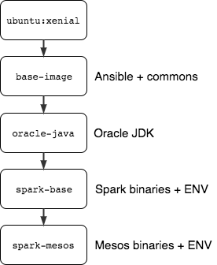

# Packer/Ansible automation for Docker images
### Overview
This repo contains a reference implementation of Packer/Ansible automation for Docker images.

Image and software versions controlled via [packer/vars/versions.json](packer/vars/versions.json) file.
Ansible is used for image provisioning (ansible-local Packer provisioner).

Images are organized in a hierarchy to enforce DRY(Don't Repeat Yourself) and have greater flexibility
 to select a proper image to derive from. Provisioning is focused on dependencies only and the goal of resulting images is to serve as a base further used either for new images or for configuration changes to make them runnable.

 * [packer/base-image.json](packer/base-image.json) - installs Ansible which allows to run *ansible-local* provisioner from Packer
 * [packer/oracle-java.json](packer/oracle-java.json) - derives from _base-image_ and installs Oracle JDK
 * [packer/spark-base.json](packer/spark-base.json) - derives from _oracle-java_ and installs Spark binaries
 * [packer/spark-mesos.json](packer/spark-mesos.json) - derives from _spark-base_ and installs Mesos binaries, this image is ready to be used as a Spark Docker executor image when running Spark on Mesos

 <p align="center">
   
 </p>
 
For demo purposes in this build images are neither force-pulled nor pushed to remote registries. Packer produces two versions of each image: latest and a specified version which in most cases a combination of software versions installed within it:

- datastrophic/base-image:1.0
- datastrophic/oracle-java:1.8
- datastrophic/spark-base:spark-2.2.1-hadoop2.7
- datastrophic/spark-mesos:spark-2.2.1-hadoop2.7-mesos1.4.1-2.0.1

Example for Spark image:
```
"post-processors": [
  [
    {
      "type": "docker-tag",
      "repository": "datastrophic/spark-base",
      "tag": "spark-{{user `spark_version`}}-hadoop{{user `hadoop_version`}}"
    }
  ],
  [
    {
      "type": "docker-tag",
      "repository": "datastrophic/spark-base",
      "tag": "latest"
    }
  ]
]
```

### Build and run
Prerequisites:
  - Packer
  - Docker

To modify software dependencies versions and/or update base image versions use either [packer/vars/versions.json](packer/vars/versions.json) should be modified or a new file with the same variables created.

[zbuild.sh](zbuild.sh) triggers rebuild of all image hierarchy in proper order, file with variables should be supplied as a script argument:
```
./zbuild.sh packer/vars/versions.json
```

Commands to build every specific image separately:
```
#base
packer build -var-file=packer/vars/versions.json base-image.json

#Oracle JDK
packer build -var-file=packer/vars/versions.json oracle-java.json

#Spark
packer build -var-file=packer/vars/versions.json spark-base.json

#Spark + Mesos
packer build -var-file=packer/vars/versions.json spark-mesos.json
```
